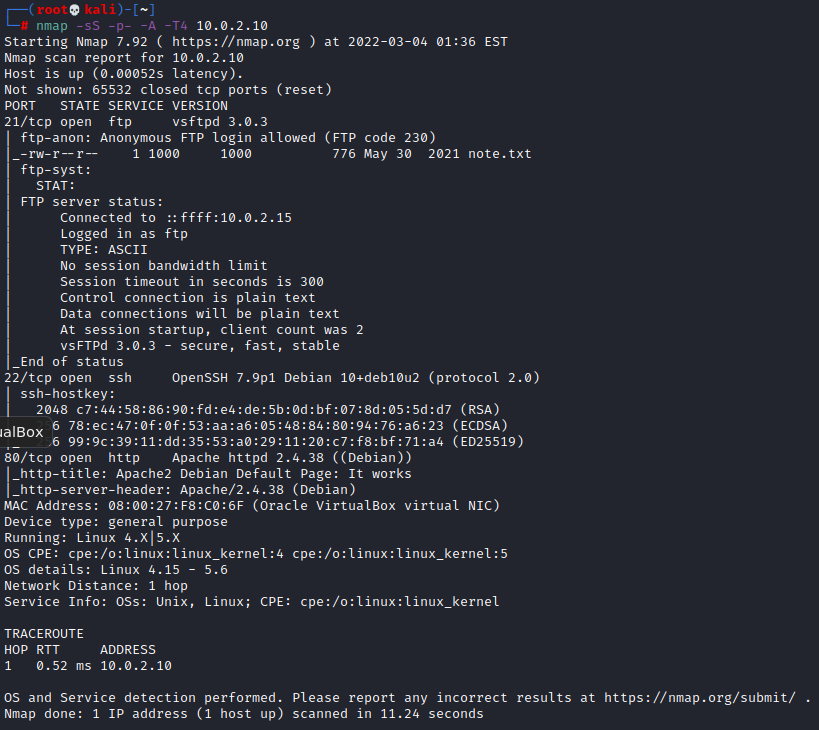
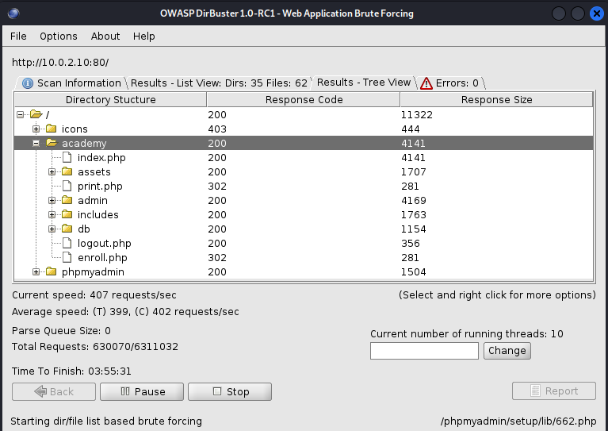
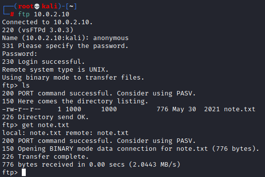
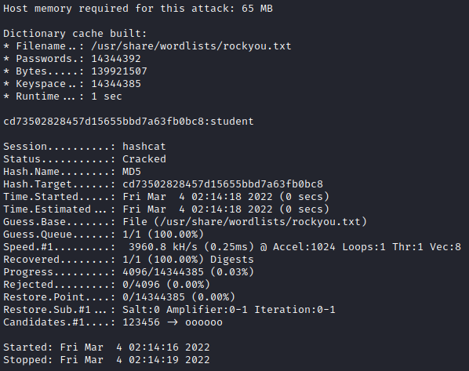
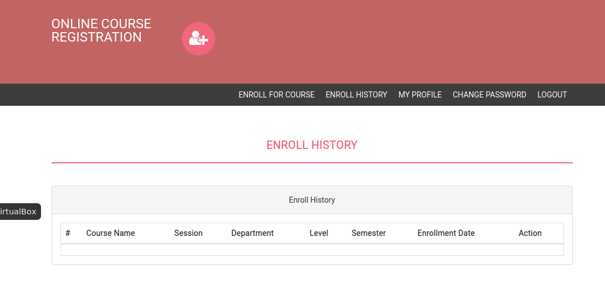

# Academy Box - Provided by TCM Security

- Box has IP address `10.0.2.10`

## Scanning and Enumeration 
- Running nmap scan against target machine

    

- Interest findings 
  - Port `21/tcp - ftp - Anonymous FTP login allowed - vsftpd 3.0.3`
  - Port `22/tcp - SSH - OpenSSH 7.9p1 Debian` 
  - Port `80/tcp - http - Apache2 httpd 2.4.38`
  - OS details - `Linux 4.15 | 5.6`

- Since I found port `80` open, running `nikto` against target 
  
  

- Also ran `Disbuster` 
  
  

## Research 
- `Anonymous FTP login allowed (FTP code 230)` was interesting in the results. 
  - Found this site - [Anonymous Login](https://vk9-sec.com/anonymous-login/)

## Exploitation

- Using `auxiliary/scanner/ftp/anonymous` module to detect anonymous FTP access

    
    
    - Results show anonymous login has `READ` permissions

- Used `anonymous` user to connect to FTP target machine 

    

- I was able to get the `note.txt` from the target. These are the contents of it

    

- Grabbed the hash from the file and used `hash-identifier`, determined it was an `MD5` hash 

    

- Used `hashcat` to crack the hash which turned out to be `student`

    

- Grabbed the Registration number from `note.txt` and the cracked password to login. 
- Once logged in was prompted to change password, so I went ahead and did that. 

