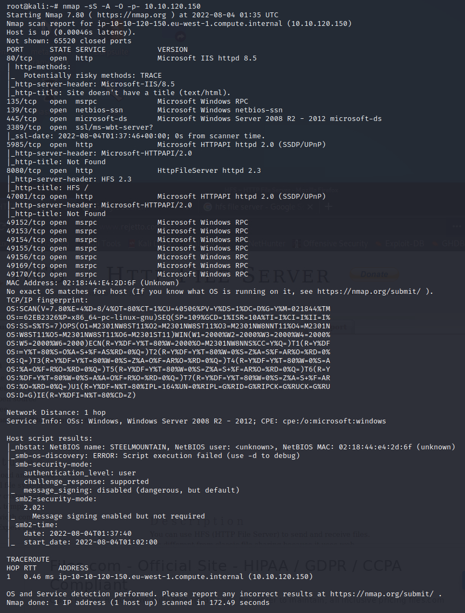
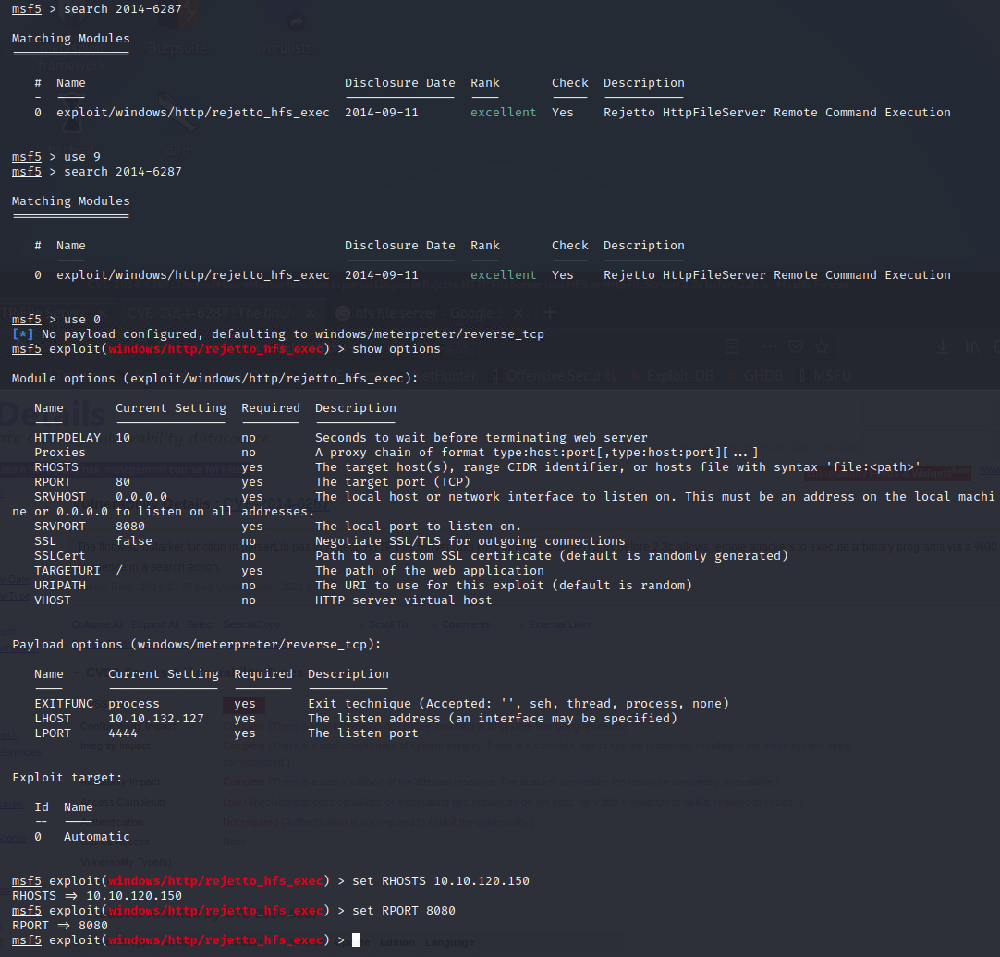
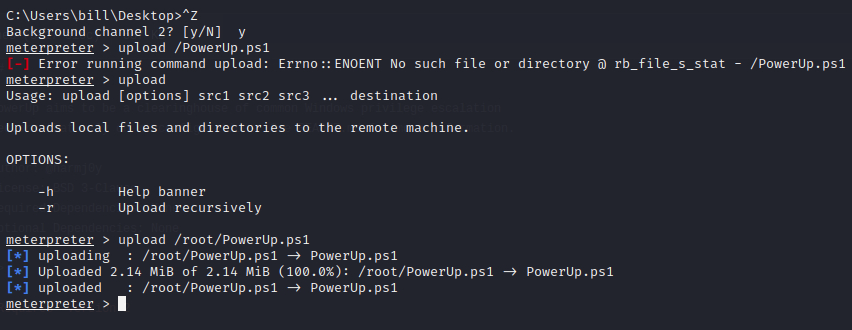
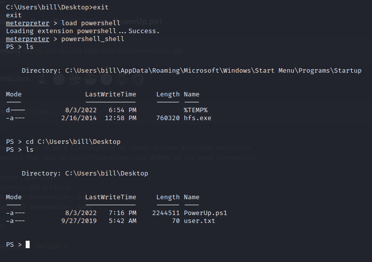
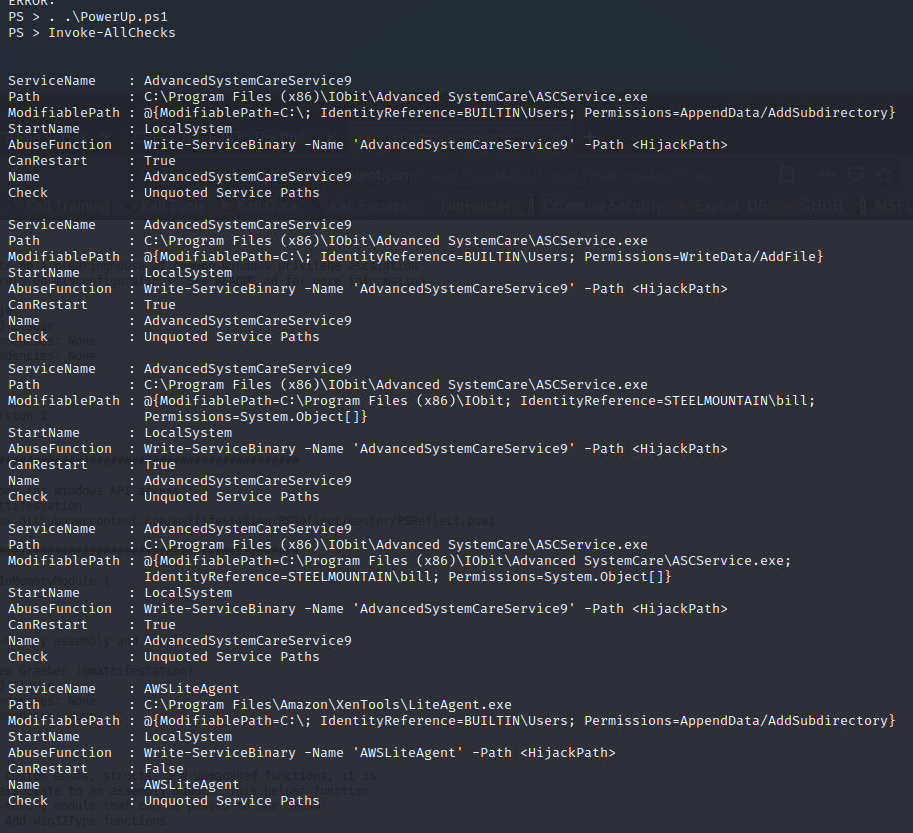
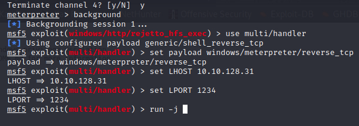

# Steel Mountain
---

## Initial Access

- Scan the machine with `nmap`

- Found [CVE-2014-6287](https://www.cvedetails.com/cve/CVE-2014-6287/) for this server

- Use `metasploit` to gain an initial shell

- Gained initial shell and found user flag 

## Privilege Escalation

- Downloaded [PowerUp.ps1](https://github.com/PowerShellMafia/PowerSploit/blob/master/Privesc/PowerUp.ps1) and then uploaded it using metasploit `upload` comamnd

- Execute using Meterpreter, using **load powershell** and **powershell_shell**

- Ran PowerUp.ps1

- Found a service with `CanRestart` option set to true. This means we can also write to the directory, replacing it with a malicious one, restart the service and run the infected program. 

- Use `msfvenom` to create a reverse shell payload as a Windows executable 

- Setup reverse shell handler

- Stop legitimate service 

- Upload malicious payload 

- Start service again

